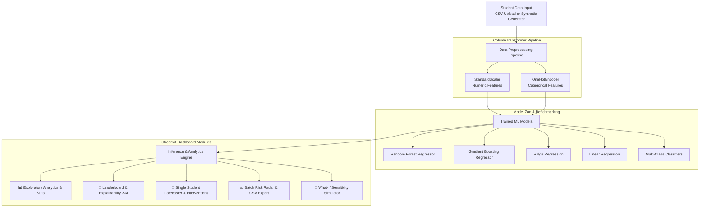

# 🎓 EduPredict AI: Student Performance & Risk Intelligence System

[](https://www.python.org/)
[](https://streamlit.io/)
[](https://scikit-learn.org/)
[](https://pandas.pydata.org/)
[](LICENSE)
[]()

An end-to-end Machine Learning web application designed to forecast student academic outcomes, identify high-risk students before examinations, and provide actionable, personalized recommendations for grade improvement.

Built with **Python**, **Pandas**, **NumPy**, **Scikit-learn**, **Matplotlib**, and **Streamlit**.

---

## 📑 Table of Contents

- [Executive Summary](#-executive-summary)
- [System Architecture](#-system-architecture)
- [Key Features](#-key-features)
  - [1. Exploratory Data Analytics (EDA)](#1-exploratory-data-analytics-eda)
  - [2. Machine Learning Benchmark & Diagnostics](#2-machine-learning-benchmark--diagnostics)
  - [3. Individual Student Performance Forecaster](#3-individual-student-performance-forecaster)
  - [4. Batch Evaluation & Risk Radar](#4-batch-evaluation--risk-radar)
  - [5. "What-If" Sensitivity Simulator](#5-what-if-sensitivity-simulator)
- [Machine Learning Pipeline](#-machine-learning-pipeline)
- [Dataset Schema](#-dataset-schema)
- [Project Directory Structure](#-project-directory-structure)
- [Quick Start & Installation](#-quick-start--installation)
- [Pushing to GitHub](#-pushing-to-github)
- [Security & Data Privacy](#-security--data-privacy)
- [License](#-license)

---

## 📌 Executive Summary

Academic attrition and student failure frequently stem from late-stage intervention, where educational institutions only detect learning difficulties after final grades are recorded. 

**EduPredict AI** bridges this gap by offering:
- **Proactive Early Warning**: Flags borderline and at-risk students weeks before examinations.
- **Explainable Machine Learning**: Quantifies how study hours, sleep habits, attendance, and environmental factors contribute to expected grades.
- **Prescriptive Guidance**: Emits tailored pedagogical recommendations for individual students (e.g., "+5 hours/week study $\rightarrow$ +7.2 points expected gain").
- **Institutional Scalability**: Offers both single-student simulation and bulk roster scoring for entire classrooms or departments.

---

## 🏗️ System Architecture



---

## ✨ Key Features

### 1. Exploratory Data Analytics (EDA)
- **Live Cohort KPIs**: Cohort size, mean exam score, pass rate ($\ge 50$ points), at-risk headcount, and average weekly study hours.
- **Interactive Visualizations**:
  - Score distribution histograms with color-coded risk bands (Fail, Average, Good, Excellent).
  - Feature correlation heatmaps with Pearson coefficients.
  - Multi-variable scatter plots (Study Hours vs. Final Score colored by Class Attendance) with polynomial trend lines.
  - Demographic comparative bar charts (Tutoring efficacy across parental education levels).
- **Interactive Inspection**: Paginated table viewer and summary descriptive statistics ($mean, std, min, max, quartiles$).

### 2. Machine Learning Benchmark & Diagnostics
- **Live Algorithm Leaderboard**: Simultaneously compares **Random Forest**, **Gradient Boosting**, **Ridge Regression**, and **Linear Regression**.
- **Model Metrics**: Evaluates models on $R^2$ Score, RMSE (Root Mean Squared Error), MAE (Mean Absolute Error), and MAPE (%).
- **Deep-Dive Diagnostic Suite**:
  - *Actual vs. Predicted* scatter plot with ideal $y = x$ reference.
  - *Residuals Error Distribution* analyzing bias and normality.
  - *Global Feature Importance* ranking top predictors and relative weights.
- **Multi-Class Classification**: Benchmarks **Random Forest**, **Gradient Boosting**, and **Logistic Regression** for grading tiers with full Confusion Matrix visualization.

### 3. Individual Student Performance Forecaster
- **Interactive Sliders & Controls**:
  - Academic habits: Past Exam Score, Weekly Study Hours, Class Attendance (%), Nightly Sleep Duration, Assignment Completion Rate (%).
  - Environmental indicators: Parental Education, Tutoring Status, Study Environment (Quiet, Moderate, Distracting), Stress Level, and Internet Access.
- **Real-Time Scoring**: Predicts final grade (0–100) with dynamic risk level badge (**High Risk**, **Moderate Risk**, **Low Risk**).
- **Prescriptive Intervention Engine**: Quantifies potential points gain for concrete behavioral adjustments:
  - Adding tutoring support.
  - Increasing self-study by $+5$ hours per week.
  - Improving attendance or homework completion rates.
  - Optimizing sleep schedule to the cognitive sweet spot (7–8 hours).

### 4. Batch Evaluation & Risk Radar
- **Cohort Upload**: Upload custom class roster CSV files or test using the pre-loaded 40-student benchmark.
- **Bulk Inference**: Instantly runs batch scoring, performance tier classification, and risk categorization.
- **Risk Composition Breakdown**: Donut chart displaying proportion of High, Moderate, and Low risk students.
- **Priority Intervention Watchlist**: Dedicated triage table isolating flagged students needing immediate academic assistance.
- **Report Export**: 1-click download of the complete scored cohort dataset as a CSV report.

### 5. "What-If" Sensitivity Simulator
- **Dynamic Habit Perturbation**: Interactively sweeps individual factors (e.g., Study Hours, Sleep, Attendance) from minimum to maximum while holding all other student parameters constant.
- **Non-Linear Dynamics**: Visualizes diminishing returns, sleep efficiency penalties, and inflection thresholds.
- **Baseline Comparison**: Plots current baseline student archetype directly against the theoretical sensitivity curve.

---

## 🧠 Machine Learning Pipeline

1. **Preprocessing (`ColumnTransformer`)**:
   - `StandardScaler`: Applied to all numeric features (`Study_Hours_Per_Week`, `Attendance_Rate`, `Past_Exam_Score`, `Sleep_Hours`, `Assignments_Completion_Rate`).
   - `OneHotEncoder`: Applied to categorical features (`Parental_Education`, `Internet_Access`, `Tutoring`, `Extracurricular_Activities`, `Study_Environment`, `Stress_Level`) with unknown handling and dummy drop.
2. **Model Training & Cross-Validation**:
   - Cached pipeline execution via Streamlit resource caching (`st.cache_resource`) for instant UI responsiveness.
   - Configurable train/test split (default 80/20) and customizable hyperparameters (number of estimators, max tree depth, learning rate).

---

## 📊 Dataset Schema

| Column Name | Type | Description | Range / Categories |
| :--- | :--- | :--- | :--- |
| `Student_ID` | String | Unique student identifier | `STU-1000` to `STU-9999` |
| `Study_Hours_Per_Week` | Float | Dedicated self-study hours outside class | `1.0` – `40.0` |
| `Attendance_Rate` | Float | Class and laboratory attendance rate | `40.0%` – `100.0%` |
| `Past_Exam_Score` | Float | Historical score in prerequisite examination | `20.0` – `100.0` |
| `Sleep_Hours` | Float | Average nightly sleep duration | `4.0` – `10.0` |
| `Assignments_Completion_Rate` | Float | Homework and assignment compliance | `30.0%` – `100.0%` |
| `Parental_Education` | String | Highest educational attainment of parents | High School, Associate, Bachelor's, Master's/PhD |
| `Internet_Access` | String | Access to reliable home broadband | `Yes` / `No` |
| `Tutoring` | String | Enrolled in extra academic tutoring | `Yes` / `No` |
| `Extracurricular_Activities` | String | Active participation in clubs or sports | `Yes` / `No` |
| `Study_Environment` | String | Quality of home study workspace | Quiet / Dedicated, Moderate Noise, Distracting |
| `Stress_Level` | String | Self-reported perceived stress level | Low, Medium, High |
| `Final_Exam_Score` | Float | Target examination score (Regression) | `0.0` – `100.0` |
| `Performance_Category` | String | Academic letter grade category | Excellent (A), Good (B), Average (C), At-Risk (Fail) |
| `Risk_Level` | String | Triage level for institutional intervention | High Risk, Moderate Risk, Low Risk |

---

## 📁 Project Directory Structure

```plaintext
student-performance-predictor/
├── .gitignore                   # Comprehensive exclusion rules (credentials, caches, virtualenvs)
├── README.md                    # Project documentation, architecture & quickstart
├── requirements.txt             # Pinned Python package dependencies
├── app.py                       # Main Streamlit web application & tab modules
├── data_generator.py            # Scientifically grounded synthetic student dataset generator
├── model_utils.py               # Preprocessing pipelines, ML models, evaluation & XAI
├── styles.py                    # Sleek dark-mode CSS styling & custom Matplotlib theme
└── data/                        # Data directory
    ├── students_data.csv        # Benchmark training dataset (1,500 records)
    └── sample_batch_roster.csv  # Unlabeled sample roster for batch scoring (40 records)
```

---

## 🚀 Quick Start & Installation

### 1. Prerequisites
- **Python 3.10** or higher installed.
- Git installed.

### 2. Clone Repository
```bash
git clone https://github.com/<YOUR-USERNAME>/student-performance-predictor.git
cd student-performance-predictor
```

### 3. Create and Activate Virtual Environment
- **Windows (PowerShell):**
  ```powershell
  python -m venv venv
  .\venv\Scripts\Activate.ps1
  ```
- **macOS / Linux:**
  ```bash
  python3 -m venv venv
  source venv/bin/activate
  ```

### 4. Install Dependencies
```bash
pip install -r requirements.txt
```

### 5. Generate Benchmark Datasets (Optional)
The application automatically generates the benchmark datasets upon first run. If you want to manually re-generate them:
```bash
python data_generator.py
```

### 6. Launch the Dashboard
```bash
streamlit run app.py
```
The application will launch in your default web browser at `http://localhost:8501`.

---

## 📤 Pushing to GitHub

To push this repository to your personal or organization GitHub account, follow these simple steps:

### Step 1: Create a New Empty Repository on GitHub
1. Sign in to [GitHub](https://github.com/).
2. Click the **`+`** icon in the top-right corner and select **New repository**.
3. Name your repository (e.g., `student-performance-predictor`).
4. Set visibility to **Public** or **Private**.
5. **Do NOT** check "Initialize this repository with a README, .gitignore, or license" (we already configured these).
6. Click **Create repository**.

### Step 2: Link and Push via Terminal
Open your terminal in the project directory and run:

```bash
# Ensure git uses the main branch
git branch -M main

# Add your GitHub repository as remote origin (replace with your repo URL)
git remote add origin https://github.com/<YOUR-USERNAME>/<YOUR-REPOSITORY-NAME>.git

# Push your code to GitHub
git push -u origin main
```

---

## 🔒 Security & Data Privacy

- **No Secrets or Credentials**: This repository contains no API keys, tokens, or confidential passwords.
- **Protected Environment**: The included `.gitignore` rigorously excludes `.env`, `*.env`, `secrets.toml`, virtual environments (`venv/`), model weights/binaries (`*.joblib`, `*.pkl`), and IDE caches.
- **Privacy Compliant**: All default student data is synthetically modeled based on educational dynamics and contains no personally identifiable information (PII).

---

## 📄 License

This project is licensed under the [MIT License](LICENSE) - feel free to use, modify, and distribute for academic and commercial applications.
